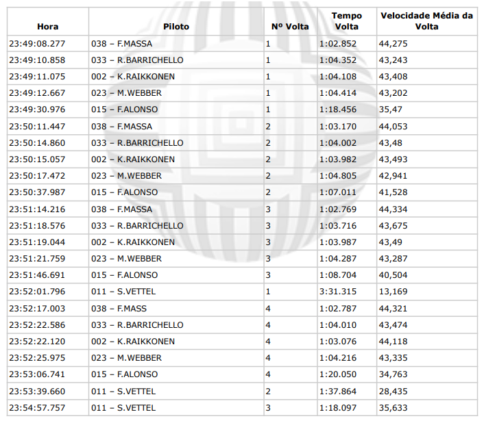

# Grupo CRIAR - Desafio Técnico

Vaga: Desenvolvedor
Área: Desenvolvimento de Software (Todas as Áreas)

Definições do teste:
Dado o seguinte log de uma corrida de Kart

## CONSTRUÇÃO

● A partir dos dados acima fornecidos, montar o resultado da corrida em um formato
tabular com as seguintes informações: Posição Chegada, Código Piloto, Nome Piloto,
Quantidade de Voltas Completadas e Tempo Total de Prova.

### Importante

○ A primeira linha do arquivo com o cabeçalho deve ser desconsiderada (Hora,
Piloto, Nº Volta, Tempo Volta, Velocidade Média da Volta).
○ A corrida termina quando o primeiro colocado completa 4 voltas

### Bônus

■ Descobrir a melhor volta de cada piloto
■ Descobrir a melhor volta da corrida
■ Calcular a velocidade média de cada piloto durante toda a corrida
■ Descobrir quanto tempo cada piloto chegou após o vencedor

## SOLUÇÃO

● A solução foi desenvolvida em Dart/Flutter;
● Uma única biblioteca externa foi utilizada a fim de se estilizar as fontes;

### Instruções de uso

Para compilar o projeto será necessário uma máquina devidamente preparada para
rodar projetos Flutter, além de um um dispositivo (real ou emulador) para se
observar em tela.
Os bônus estão contemplados em separadas telas as quais podem ser acessadas via
botões localizados na Home Page (tela principal da aplicação);
